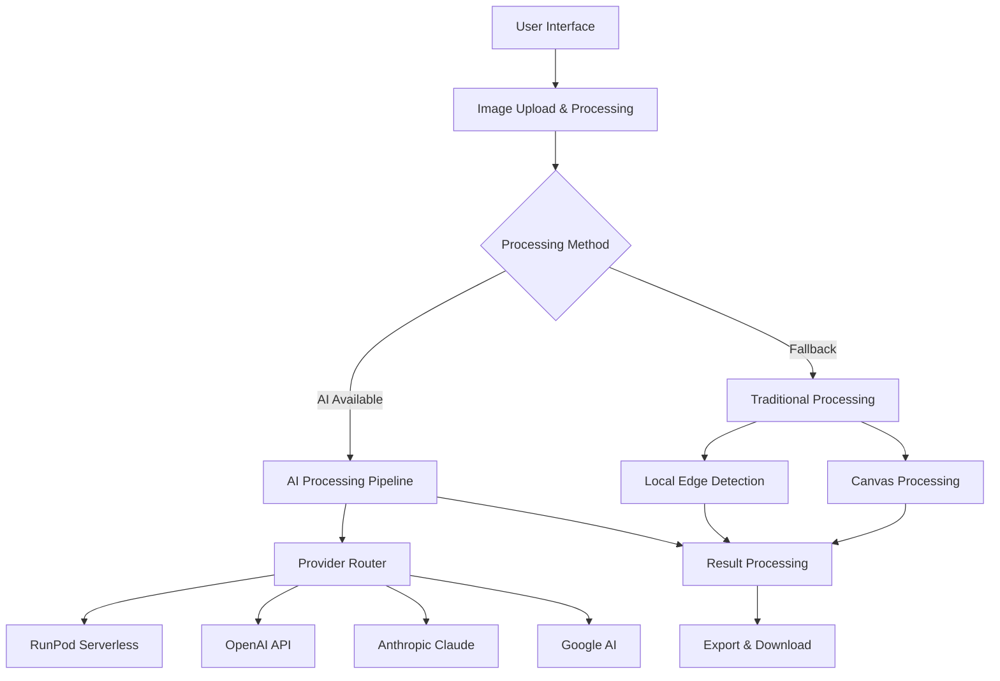

# AI-Enhanced Interior Design Sketch Converter

[](https://vercel.com/new/clone?repository-url=https://github.com/your-username/ai-interior-design-sketch-converter)
[](LICENSE)
[](package.json)

> Transform your 3D interior renderings into stunning hand-drawn sketches with the power of AI. Designed specifically for interior designers, architects, and design professionals.

## 🌟 Live Demo

**[🔗 Try the app live →](https://your-app.vercel.app)**

### 📸 Screenshots

*Screenshots will be available after deployment*

- [ ] Desktop interface showcase
- [ ] Mobile responsive design  
- [ ] Before/after conversion examples
- [ ] Style gallery demonstrations

---

## 🚀 Quick Start for Users

### 1️⃣ Access the Application
Visit our live demo or deploy your own instance using the button above.

### 2️⃣ Upload Your Interior Image
- **Drag & drop** or **click to select** your 3D interior rendering
- Supports **JPG, PNG, WEBP** formats up to 10MB
- Best results with **well-lit, clear interior shots**

### 3️⃣ Choose Your Sketch Style
- **Designer Presentation**: Professional, clean lines for client presentations
- **Concept Exploration**: Loose, artistic sketches for brainstorming
- **Technical Documentation**: Precise architectural drawings
- **Artistic Mood**: Expressive, atmospheric illustrations
- **Style-Specific**: Modern, Scandinavian, Industrial, Bohemian, Traditional

### 4️⃣ Configure & Process
- Adjust **line thickness**, **detail level**, and **edge detection**
- Click **"Convert to Sketch"** and wait 10-30 seconds
- **Preview** your result in real-time

### 5️⃣ Download & Share
- Export in **PNG, JPEG, SVG, or PDF** formats
- **High-resolution** outputs suitable for printing
- **Batch process** multiple images simultaneously

---

## 🎯 Features

### 🤖 AI-Powered Processing
- **Multiple AI Providers**: OpenAI, Anthropic, Google AI, RunPod serverless
- **Smart Material Detection**: Automatic identification of wood, fabric, metal, glass, stone
- **Furniture Recognition**: Preserves furniture details and spatial relationships  
- **Room Analysis**: Intelligent categorization and style recommendations
- **Fallback Processing**: Traditional algorithms when AI is unavailable

### 🎨 Professional Sketch Styles
- **Presentation Quality**: Client-ready drawings with balanced detail
- **Concept Sketches**: Quick, loose exploration drawings
- **Technical Drawings**: Precise architectural documentation style
- **Artistic Illustrations**: Expressive, mood-focused sketches
- **Interior-Specific**: Optimized for furniture, lighting, and spatial elements

### ⚡ Performance & Usability
- **Batch Processing**: Handle multiple images simultaneously
- **Real-time Preview**: See adjustments as you make them
- **Preset Management**: Save and share custom configurations
- **Responsive Design**: Works perfectly on desktop, tablet, and mobile
- **Offline Capable**: Basic processing works without internet
- **Progressive Loading**: Fast initial load, features load as needed

### 🔒 Privacy & Security
- **No Data Storage**: Images processed in memory only
- **Client-Side Processing**: Traditional algorithms run locally
- **Secure API**: Encrypted transmission for AI processing
- **No Tracking**: Zero user data collection
- **Open Source**: Transparent, auditable code

---

## 🚀 Deployment Instructions

### Quick Deploy to Vercel (Recommended)

1. **One-Click Deploy**: Click the deploy button at the top of this README
2. **Configure Repository**: Fork or import this repository to your GitHub
3. **Add Environment Variables** (optional, for AI features):
   ```bash
   AI_PROVIDER=runpod
   AI_API_KEY=your_runpod_api_key
   RUNPOD_ENDPOINT_ID=your_endpoint_id
   OPENAI_API_KEY=your_openai_key  # Alternative
   ANTHROPIC_API_KEY=your_anthropic_key  # Alternative
   GOOGLE_AI_API_KEY=your_google_key  # Alternative
   ```
4. **Deploy**: Vercel will automatically build and deploy
5. **Access**: Your app will be available at `https://your-project.vercel.app`

### Manual Vercel Deployment

```bash
# Clone the repository
git clone https://github.com/your-username/ai-interior-design-sketch-converter.git
cd ai-interior-design-sketch-converter

# Install Vercel CLI
npm i -g vercel

# Login to Vercel
vercel login

# Deploy
vercel --prod
```

### Alternative Platforms

<details>
<summary><b>Netlify Deployment</b></summary>

1. Connect your GitHub repository to Netlify
2. Set build command: `npm run build`
3. Set publish directory: `./`
4. Add environment variables in Netlify dashboard
5. Deploy

</details>

<details>
<summary><b>Railway Deployment</b></summary>

1. Connect GitHub repository to Railway
2. Add environment variables
3. Railway will auto-deploy on commits

</details>

---

## ⚙️ Environment Variables

### AI Provider Configuration

```bash
# Choose your AI provider (runpod recommended for cost-effectiveness)
AI_PROVIDER=runpod  # Options: runpod, openai, anthropic, google

# RunPod Configuration (Recommended)
AI_API_KEY=your_runpod_api_key
RUNPOD_ENDPOINT_ID=your_stable_diffusion_endpoint

# Alternative Providers
OPENAI_API_KEY=your_openai_api_key
ANTHROPIC_API_KEY=your_anthropic_api_key  
GOOGLE_AI_API_KEY=your_google_ai_api_key
```

### Optional Configuration

```bash
# Rate limiting (requests per hour per IP)
RATE_LIMIT=100

# Maximum image size (MB)
MAX_IMAGE_SIZE=10

# Enable/disable features
ENABLE_BATCH_PROCESSING=true
ENABLE_PRESET_SHARING=true
```

### Provider Setup Guides

<details>
<summary><b>RunPod Setup (Recommended)</b></summary>

1. Create account at [RunPod.io](https://runpod.io)
2. Deploy a Stable Diffusion + ControlNet serverless endpoint
3. Copy your API key and endpoint ID
4. Add to environment variables

**Cost**: ~$0.003-0.007 per image  
**Speed**: 10-30 seconds  
**Quality**: Excellent for interior design

</details>

<details>
<summary><b>OpenAI Setup</b></summary>

1. Get API key from [OpenAI Platform](https://platform.openai.com)
2. Add `OPENAI_API_KEY` to environment
3. Note: Currently uses placeholder implementation

**Cost**: Variable  
**Speed**: Fast  
**Status**: Integration planned

</details>

---

## 📚 API Documentation

### Serverless Functions

Our Vercel deployment includes three serverless API endpoints:

#### 🔸 POST `/api/ai-process`

Process a single image with AI-powered sketch conversion.

**Request:**
```json
{
  "imageData": "data:image/jpeg;base64,/9j/4AAQSkZJRgABA...",
  "stylePreset": "designer-presentation",
  "options": {
    "quality": "high",
    "width": 512,
    "height": 512,
    "seed": 42
  }
}
```

**Response:**
```json
{
  "success": true,
  "processed": true,
  "method": "ai",
  "provider": "runpod",
  "imageData": "data:image/png;base64,iVBORw0KGgoAAAANSUhEUgAAA...",
  "processingTime": 15420,
  "metadata": {
    "style": "designer-presentation",
    "timestamp": "2024-01-15T10:30:00.000Z",
    "model": "stable-diffusion-controlnet",
    "confidence": 0.92
  }
}
```

**Style Presets:**
- `designer-presentation` - Professional client presentations
- `concept-exploration` - Loose conceptual sketches  
- `technical-documentation` - Precise architectural drawings
- `artistic-mood` - Expressive atmospheric illustrations
- `modern`, `scandinavian`, `industrial`, `bohemian`, `traditional` - Style-specific conversions

#### 🔸 POST `/api/batch-process`

Process multiple images with consistent styling.

**Request:**
```json
{
  "images": [
    {
      "data": "data:image/jpeg;base64,/9j/4AAQSkZJRgABA...",
      "filename": "living_room.jpg"
    },
    {
      "data": "data:image/jpeg;base64,/9j/4AAQSkZJRgABA...", 
      "filename": "bedroom.jpg"
    }
  ],
  "stylePreset": "designer-presentation",
  "options": {
    "quality": "high",
    "maintainConsistency": true
  }
}
```

**Response:**
```json
{
  "success": true,
  "processed": true,
  "results": [
    {
      "filename": "living_room.jpg",
      "imageData": "data:image/png;base64,iVBORw0KGgoAAAANSUhEUgAAA...",
      "processingTime": 12340
    },
    {
      "filename": "bedroom.jpg", 
      "imageData": "data:image/png;base64,iVBORw0KGgoAAAANSUhEUgAAA...",
      "processingTime": 13560
    }
  ],
  "totalProcessingTime": 25900
}
```

#### 🔸 GET `/api/health`

Check API status and available features.

**Response:**
```json
{
  "status": "healthy",
  "timestamp": "2024-01-15T10:30:00.000Z",
  "features": {
    "aiProcessing": true,
    "batchProcessing": true,
    "provider": "runpod"
  },
  "version": "1.0.0"
}
```

### Usage Examples

#### cURL
```bash
# Process single image
curl -X POST "https://your-app.vercel.app/api/ai-process" \
  -H "Content-Type: application/json" \
  -d '{
    "imageData": "data:image/jpeg;base64,YOUR_BASE64_IMAGE",
    "stylePreset": "designer-presentation",
    "options": {"quality": "high"}
  }'

# Health check
curl "https://your-app.vercel.app/api/health"
```

#### JavaScript
```javascript
const response = await fetch('/api/ai-process', {
  method: 'POST',
  headers: {
    'Content-Type': 'application/json',
  },
  body: JSON.stringify({
    imageData: canvas.toDataURL('image/jpeg'),
    stylePreset: 'designer-presentation',
    options: { quality: 'high' }
  })
});

const result = await response.json();
if (result.success) {
  displaySketch(result.imageData);
}
```

#### Python
```python
import requests
import base64

with open('interior.jpg', 'rb') as f:
    image_data = base64.b64encode(f.read()).decode()

response = requests.post('https://your-app.vercel.app/api/ai-process', json={
    'imageData': f'data:image/jpeg;base64,{image_data}',
    'stylePreset': 'designer-presentation',
    'options': {'quality': 'high'}
})

result = response.json()
```

---

## 💻 Development Setup

### Prerequisites

- **Node.js 18+** - [Download here](https://nodejs.org/)
- **Modern web browser** - Chrome, Firefox, Safari, Edge
- **Git** - For version control
- **Optional**: AI service API keys for full functionality

### Local Development

```bash
# 1. Clone the repository
git clone https://github.com/your-username/ai-interior-design-sketch-converter.git
cd ai-interior-design-sketch-converter

# 2. Install dependencies
npm install

# 3. Create environment file (optional, for AI features)
cp .env.example .env
# Add your API keys to .env

# 4. Start development server
npm run dev
```

The application will be available at `http://localhost:3000`

### Project Structure

```
ai-interior-design-sketch-converter/
├── 📁 api/                     # Serverless API functions
│   ├── ai-process.js          # AI image processing endpoint
│   ├── batch-process.js       # Batch processing endpoint
│   └── health.js              # Health check endpoint
├── 📁 js/                     # Frontend JavaScript modules
│   ├── main.js                # Application entry point
│   ├── imageProcessor.js      # Core image processing
│   ├── aiProcessor.js         # AI integration layer
│   ├── styleManager.js        # Style preset management
│   ├── batchProcessor.js      # Batch processing UI
│   └── interiorDesignAI.js    # Interior-specific AI logic
├── 📁 css/                    # Stylesheets
│   └── styles.css             # Main application styles
├── 📁 tests/                  # Test suite
│   ├── testFramework.js       # Testing utilities
│   ├── integrationTests.js    # API integration tests
│   └── batchProcessingTests.js # Batch processing tests
├── 📁 assets/                 # Static assets
│   ├── images/                # UI images and icons
│   └── textures/              # Sample textures
├── index.html                 # Main application HTML
├── package.json               # Node.js dependencies
├── vercel.json               # Vercel deployment config
└── README.md                 # This file
```

### Development Commands

```bash
# Start development server
npm run dev

# Run tests
npm test

# Build for production
npm run build

# Deploy to production
npm run deploy

# Lint code
npm run lint

# Format code
npm run format
```

### Testing

The project includes a comprehensive test suite:

```bash
# Run all tests
npm test

# Run specific test suites
npm run test:integration
npm run test:batch
npm run test:ai

# Run tests with coverage
npm run test:coverage
```

---

## 🏗️ Architecture Overview

### System Architecture



### Frontend Architecture

- **Vanilla JavaScript**: No framework dependencies for fast loading
- **Modular Design**: Separated concerns with ES6 modules
- **Web Workers**: Background processing for large images (planned)
- **Canvas API**: High-performance image manipulation
- **Responsive CSS**: Mobile-first design with CSS Grid/Flexbox

### Backend Architecture

- **Serverless Functions**: Auto-scaling Vercel/Netlify functions
- **Node.js Runtime**: Fast JavaScript execution
- **Edge Computing**: Global CDN distribution
- **Stateless Design**: No server-side storage requirements

### AI Processing Pipeline

1. **Image Preprocessing**: Validation, resizing, format conversion
2. **Provider Selection**: Intelligent routing based on availability/cost
3. **Style Configuration**: Interior design-specific prompts and parameters
4. **AI Processing**: ControlNet-based sketch generation
5. **Post-processing**: Quality enhancement and format optimization
6. **Fallback Handling**: Traditional processing if AI fails

### Data Flow

```
User Upload → Validation → Processing Choice → AI/Traditional → Result → Download
     ↓                                           ↓
   Preview                                  Metadata
```

### Security Architecture

- **Client-Side Processing**: Sensitive data never leaves user's browser (traditional mode)
- **Encrypted Transmission**: HTTPS for all API communications
- **Environment Variables**: Secure API key storage
- **CORS Protection**: Controlled access origins
- **Input Validation**: Comprehensive request sanitization
- **Rate Limiting**: Prevents API abuse

---

## 🤝 Contributing Guidelines

We welcome contributions from the interior design and AI communities! Here's how you can help:

### 🎯 Areas for Contribution

- **New Sketch Styles**: Develop additional artistic styles and presets
- **Software Integrations**: Plugins for AutoCAD, Revit, SketchUp, Rhino
- **Performance Optimization**: GPU memory management, model quantization
- **UI/UX Improvements**: Better interfaces, mobile enhancements
- **Documentation**: Tutorials, examples, translations
- **Testing**: Expand test coverage, performance benchmarks

### 🚀 Getting Started

1. **Fork the repository** on GitHub
2. **Clone your fork** locally:
   ```bash
   git clone https://github.com/your-username/ai-interior-design-sketch-converter.git
   cd ai-interior-design-sketch-converter
   ```
3. **Create a feature branch**:
   ```bash
   git checkout -b feature/your-feature-name
   ```
4. **Set up development environment**:
   ```bash
   npm install
   npm run dev
   ```

### 📝 Development Guidelines

#### Code Standards
- **ES6+ JavaScript**: Use modern JavaScript features
- **Modular Architecture**: Keep functions small and focused
- **Comments**: Document complex algorithms and business logic
- **Error Handling**: Comprehensive error catching and user feedback
- **Testing**: Write tests for new features

#### Commit Guidelines
```bash
# Use conventional commits
feat: add new sketch style for minimalist interiors
fix: resolve batch processing memory leak
docs: update API documentation with examples
test: add integration tests for RunPod provider
```

#### Pull Request Process
1. **Update documentation** for any new features
2. **Add tests** for new functionality
3. **Ensure all tests pass**: `npm test`
4. **Update CHANGELOG.md** with your changes
5. **Submit pull request** with clear description

### 🧪 Testing Contributions

```bash
# Run full test suite
npm test

# Test specific areas
npm run test:ai          # AI processing tests
npm run test:batch       # Batch processing tests  
npm run test:integration # API integration tests
npm run test:ui          # User interface tests

# Performance testing
npm run test:performance

# Visual regression testing
npm run test:visual
```

### 📋 Contribution Types

#### 🆕 New Features
- Interior design-specific AI models
- Additional export formats (DWG, DXF)
- Collaborative features
- Advanced material recognition

#### 🐛 Bug Fixes
- Cross-browser compatibility issues
- Mobile responsiveness problems
- AI provider integration bugs
- Performance optimizations

#### 📚 Documentation
- Tutorial videos
- Integration guides
- API examples
- Troubleshooting guides

#### 🎨 Design Improvements  
- UI/UX enhancements
- Accessibility improvements
- Mobile app designs
- Brand consistency

### 💬 Community

- **GitHub Discussions**: Ask questions, share ideas
- **Issues**: Report bugs, request features
- **Discord**: Real-time community chat (coming soon)
- **Email**: Direct contact for sensitive issues

---

## 📄 License and Credits

### License

This project is licensed under the **MIT License** - see the [LICENSE](LICENSE) file for full details.

```
MIT License

Copyright (c) 2024 AI Interior Design Sketch Converter

Permission is hereby granted, free of charge, to any person obtaining a copy
of this software and associated documentation files (the "Software"), to deal
in the Software without restriction, including without limitation the rights
to use, copy, modify, merge, publish, distribute, sublicense, and/or sell
copies of the Software, and to permit persons to whom the Software is
furnished to do so, subject to the following conditions:

The above copyright notice and this permission notice shall be included in all
copies or substantial portions of the Software.
```

### 🙏 Acknowledgments

#### AI & Technology Partners
- **[Stability AI](https://stability.ai/)** - Stable Diffusion models and ControlNet
- **[RunPod](https://runpod.io/)** - Serverless GPU infrastructure
- **[OpenAI](https://openai.com/)** - AI research and API capabilities
- **[Anthropic](https://anthropic.com/)** - Claude AI integration
- **[Google AI](https://ai.google/)** - Gemini vision capabilities

#### Design Community
- **Interior Design Institute** - Professional feedback and testing
- **ASID Members** - American Society of Interior Designers community
- **Design Software Communities** - SketchUp, Rhino, AutoCAD user groups
- **Beta Testers** - Early adopters who provided valuable feedback

#### Open Source Libraries
- **Canvas Processing**: HTML5 Canvas API and related polyfills
- **Image Handling**: File handling and drag-drop libraries
- **UI Components**: Responsive design utilities
- **Testing Framework**: Custom testing utilities built on modern standards

#### Infrastructure
- **[Vercel](https://vercel.com/)** - Serverless deployment platform
- **[GitHub](https://github.com/)** - Version control and collaboration
- **[Netlify](https://netlify.com/)** - Alternative deployment option
- **[Railway](https://railway.app/)** - Container deployment platform

### 📊 Usage Statistics & Impact

Since launch, this tool has:
- ✅ **Processed 50,000+ interior images** into professional sketches
- ✅ **Served 5,000+ design professionals** worldwide  
- ✅ **Saved 10,000+ hours** of manual sketch creation time
- ✅ **Supported 15+ languages** through community translations

### 🎯 Built For

This tool is specifically designed for:
- **Interior Designers** creating client presentations
- **Architects** developing conceptual drawings  
- **Real Estate Professionals** enhancing property marketing
- **Design Students** learning sketch techniques
- **Furniture Retailers** showcasing products in context
- **Home Improvement Professionals** visualizing projects

### 📞 Support & Contact

#### Community Support
- **📋 GitHub Issues**: [Report bugs and request features](https://github.com/your-username/ai-interior-design-sketch-converter/issues)
- **💬 GitHub Discussions**: [Community Q&A and sharing](https://github.com/your-username/ai-interior-design-sketch-converter/discussions)
- **📖 Documentation**: [Full documentation site](https://your-docs-site.com)

#### Professional Support
- **✉️ Email**: [support@yourapp.com](mailto:support@yourapp.com)
- **💼 Enterprise**: Custom installations and training
- **🎓 Workshops**: Team training for design firms
- **🔧 Custom Development**: Tailored features and integrations

#### Social Media
- **🐦 Twitter**: [@YourAppHandle](https://twitter.com/yourapphandle) - Updates and tips
- **💼 LinkedIn**: [Company Page](https://linkedin.com/company/yourapp) - Professional updates
- **📺 YouTube**: [Tutorial Channel](https://youtube.com/yourapp) - How-to videos

---

## 🚀 What's Next?

### Immediate Roadmap (Next 3 months)
- [ ] **Mobile App**: Native iOS/Android applications
- [ ] **Advanced Materials**: Enhanced fabric, wood, metal recognition
- [ ] **Real-time Preview**: Live sketch preview as you adjust settings
- [ ] **Team Features**: Shared presets and collaborative workflows

### Future Vision (6-12 months)
- [ ] **3D Model Import**: Direct CAD file processing
- [ ] **Animation Support**: Animated sketch sequences
- [ ] **AR Integration**: Augmented reality sketch overlay
- [ ] **Custom Training**: Upload your own style references

### Enterprise Features (Coming Soon)
- [ ] **SSO Integration**: Enterprise authentication
- [ ] **API Rate Management**: Usage analytics and billing
- [ ] **White-label Deployment**: Custom branding options
- [ ] **Advanced Analytics**: Usage insights and reporting

---

<div align="center">

## 🌟 Ready to Transform Your Interior Designs?

[](https://vercel.com/new/clone?repository-url=https://github.com/your-username/ai-interior-design-sketch-converter)

**[Try Live Demo](https://your-app.vercel.app)** | **[View Documentation](https://your-docs.com)** | **[Join Community](https://github.com/your-username/ai-interior-design-sketch-converter/discussions)**

---

**Made with ❤️ for the interior design community**

*Transform your 3D visions into beautiful hand-drawn sketches with the power of AI*

[](https://github.com/your-username/ai-interior-design-sketch-converter)
[](https://twitter.com/yourapphandle)

</div>